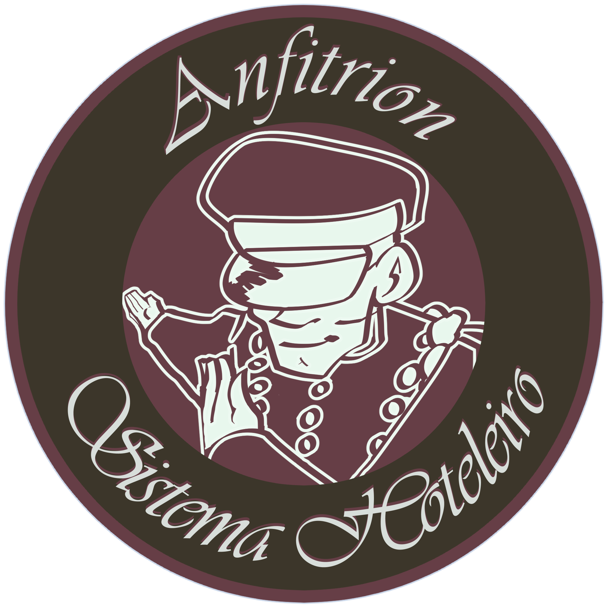

## Paleta de cores

<h3 style='color:#E8F7EE';>● #E8F7EE</h3>
<h3 style='color:#B8C4BB';>● #B8C4BB</h3>
<h3 style='color:#663F46';>● #663F46</h3>
<h3 style='color:#3C362A';>● #3C362A</h3>
<h3 style='color:#C9D6EA';>● #C9D6EA</h3>

---

## linguagens e tecnologias

|     frontend      |    backend    | banco de dados |
| :---------------: | :-----------: | :------------: |
| React/ javascript | Flask/ python |     SQLite     |

---

## Estrutura de pastas, orientação de programação & Desing pattern

Para o sistema todo será utilizado duas orientações de programação, a principal sendo por objeto (POO) e a segundo por reuso (OO). Onde a qual a estrutura de pastas será por componentes & features

### Design Pattern que devem ser aplicados:

- Factory Method
- Abstract factory
- Builder
- Prototype
- Singleton

---

## Interfaces

- Tela principal mostrando as ofertas das reservas
  - Entretanto, so podera pagar ou visualizar mais detalhes se tiver cadastrado
- Tela de login (para hospedes & funcionarios)
  - Contendo email & senha (com icon de olho para esconder ou mostrar a senha inserida)
- Tela cadastro (para hospedes)
  - Contendo nome, email, senha e telefone
  - O cadastro das contas dos funcionarios é feito pelo gerente/sub-gerente/administrador do sistema
    - Onde contera nome, email, senha, telefone & cargo (que será entre camarera/governanta, recepcionista, assistente de reservas, analista financeiro)
